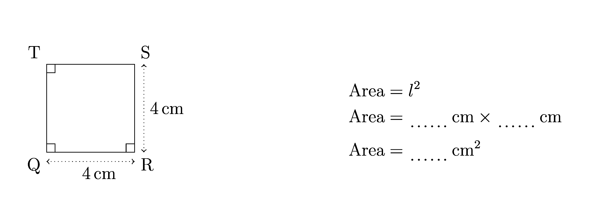
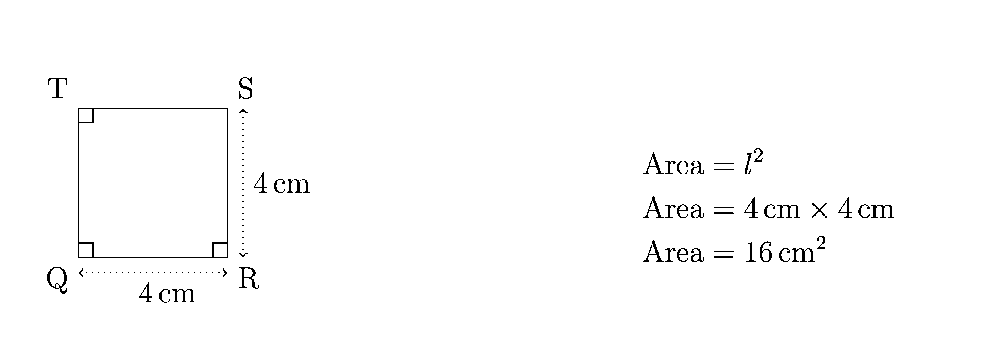

====================================================
Area of Squares
====================================================

| The diagrams below show a square with the area to be calculated.
| These are python generated via LaTeX with separate question and answer sheet pdfs.

----

Sample Question diagram
-----------------------------

| A sample question diagram is shown below.

----

Sample Answer diagram
----------------------------

| A sample answer diagram is shown below.

----

Sample Tex and pdf files
--------------------------------

| Question sheet:
| :download:`area_squares_1_q.tex<files/area_squares_1_q.tex>`
| :download:`area_squares_1_q.pdf<files/area_squares_1_q.pdf>`

| Answer sheet:
| :download:`area_squares_1_ans.tex<files/area_squares_1_ans.tex>`
| :download:`area_squares_1_ans.pdf<files/area_squares_1_ans.pdf>`

-----

Booklets using python
-----------------------------

| The booklet files below are generated using python and LaTeX templates.

Required files:

| :download:`area_squares_booklet_ans_template.tex<makers/area_squares_booklet_ans_template.tex>`
| :download:`area_squares_booklet_template.tex<makers/area_squares_booklet_template.tex>`
| :download:`area_squares_booklet_diagram_template.tex<makers/area_squares_booklet_diagram_template.tex>`

| :download:`area_squares_functions.py<makers/area_squares_functions.py>`
| :download:`area_squares_booklet_maker.py<makers/area_squares_booklet_maker.py>`

----

Sample booklet Tex and pdf files
-------------------------------------

| Question sheet:
| :download:`area_squares_Bk_20_q.tex<booklets/area_squares_Bk_20_q.tex>`
| :download:`area_squares_Bk_20_q.pdf<booklets/area_squares_Bk_20_q.pdf>`

| Answer sheet:
| :download:`area_squares_Bk_20_ans.tex<booklets/area_squares_Bk_20_ans.tex>`
| :download:`area_squares_Bk_20_ans.pdf<booklets/area_squares_Bk_20_ans.pdf>`

