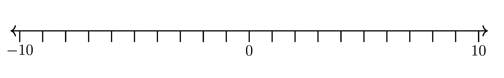

====================================================
Blank Number Lines booklet
====================================================

Multi page booklets
----------------------

| The Booklet code allows 8 diagrams per page, for up to 10 pages.
| There are 3 blanks0 number lines:

 - -10 to 10
 - 0 to 20
 - -20 to 0

Booklet template
~~~~~~~~~~~~~~~~~~~~

| All 3 number liens use the same booklet template.
| The multi page LaTeX number lines booklet template is below.
| :download:`number_lines_blank_booklet_template.tex<makers/number_lines_blank_booklet_template.tex>`

.. literalinclude:: makers/number_lines_blank_booklet_template.tex
   :linenos:

----

Blank -10 to 10
--------------------------

.. grid:: 1
   :gutter: 0
   :margin: 0
   :padding: 0

   .. grid-item-card::

      nlBk_blank
      ^^^
      :download:`pdf<booklets/nlBk_blank.pdf>`
      :download:`tex<booklets/nlBk_blank.tex>`

Diagram template
~~~~~~~~~~~~~~~~~~~~~~~~~~~~~~~~~

| The booklet diagram template is below.
| :download:`number_lines_blank_booklet_diagram_template.tex<makers/number_lines_blank_booklet_diagram_template.tex>`

.. literalinclude:: makers/number_lines_blank_booklet_diagram_template.tex
   :linenos:

----

Blank 0 to 20
--------------------------

.. grid:: 1
   :gutter: 0
   :margin: 0
   :padding: 0

   .. grid-item-card::

      nlBk_blank_0to20
      ^^^
      :download:`pdf<booklets/nlBk_blank_0to20.pdf>`
      :download:`tex<booklets/nlBk_blank_0to20.tex>`

Booklet diagram template
~~~~~~~~~~~~~~~~~~~~~~~~~~~~~~~~~

| The booklet diagram template is below.
| :download:`number_lines_0to20_blank_booklet_diagram_template.tex<makers/number_lines_0to20_blank_booklet_diagram_template.tex>`

.. literalinclude:: makers/number_lines_0to20_blank_booklet_diagram_template.tex
   :linenos:

----

Blank -20 to 0
--------------------------

.. grid:: 1
   :gutter: 0
   :margin: 0
   :padding: 0

   .. grid-item-card::

      nlBk_blank_neg20to0
      ^^^
      :download:`pdf<booklets/nlBk_blank_neg20to0.pdf>`
      :download:`tex<booklets/nlBk_blank_neg20to0.tex>`

Booklet diagram template
~~~~~~~~~~~~~~~~~~~~~~~~~~~~~~~~~

| The booklet diagram template is below.
| :download:`number_lines_neg20to0_blank_booklet_diagram_template.tex<makers/number_lines_neg20to0_blank_booklet_diagram_template.tex>`

.. literalinclude:: makers/number_lines_neg20to0_blank_booklet_diagram_template.tex
   :linenos:

