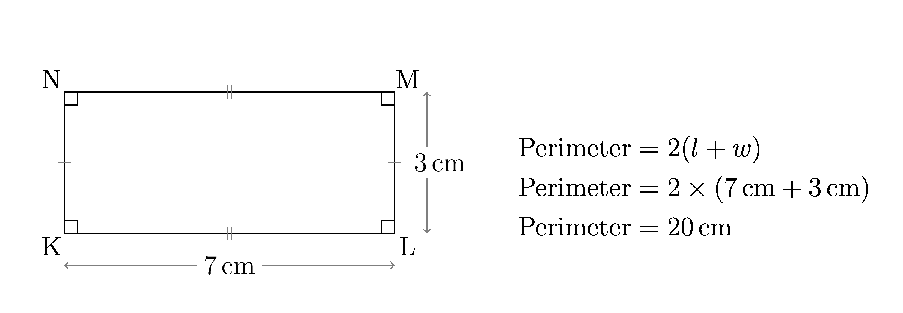

====================================================
Perimeter of Rectangles
====================================================

| The diagrams below show a rectangle with the perimeter to be calculated.
| These are python generated via LaTeX with separate question and answer sheet pdfs.

----

Sample Question diagram
-----------------------------

| A sample question diagram is shown below.

.. image:: files/perimeter_rectangles_1_q.png
    :width: 600

----

Sample Answer diagram
----------------------------

| A sample answer diagram is shown below.

----

Sample Tex and pdf files
--------------------------------

| Question sheet:
| :download:`perimeter_rectangles_1_q.tex<files/perimeter_rectangles_1_q.tex>`
| :download:`perimeter_rectangles_1_q.pdf<files/perimeter_rectangles_1_q.pdf>`

| Answer sheet:
| :download:`perimeter_rectangles_1_ans.tex<files/perimeter_rectangles_1_ans.tex>`
| :download:`perimeter_rectangles_1_ans.pdf<files/perimeter_rectangles_1_ans.pdf>`

-----

Booklets using python
-----------------------------

| The booklet files below are generated using python and LaTeX templates.

Required files:

| :download:`perimeter_rectangles_booklet_ans_template.tex<makers/perimeter_rectangles_booklet_ans_template.tex>`
| :download:`perimeter_rectangles_booklet_template.tex<makers/perimeter_rectangles_booklet_template.tex>`
| :download:`perimeter_rectangles_booklet_diagram_template.tex<makers/perimeter_rectangles_booklet_diagram_template.tex>`

| :download:`perimeter_rectangles_functions.py<makers/perimeter_rectangles_functions.py>`
| :download:`perimeter_rectangles_booklet_maker.py<makers/perimeter_rectangles_booklet_maker.py>`

----

Sample booklet Tex and pdf files
-------------------------------------

| Question sheet:
| :download:`perimeter_rectangles_Bk_20_q.tex<booklets/perimeter_rectangles_Bk_20_q.tex>`
| :download:`perimeter_rectangles_Bk_20_q.pdf<booklets/perimeter_rectangles_Bk_20_q.pdf>`

| Answer sheet:
| :download:`perimeter_rectangles_Bk_20_ans.tex<booklets/perimeter_rectangles_Bk_20_ans.tex>`
| :download:`perimeter_rectangles_Bk_20_ans.pdf<booklets/perimeter_rectangles_Bk_20_ans.pdf>`

