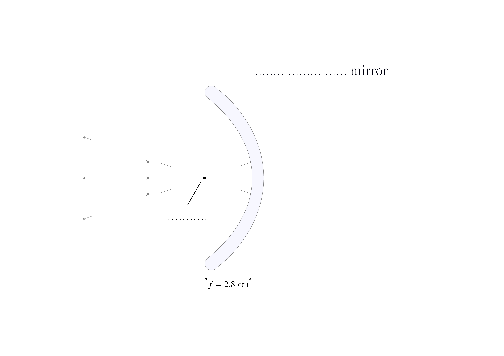
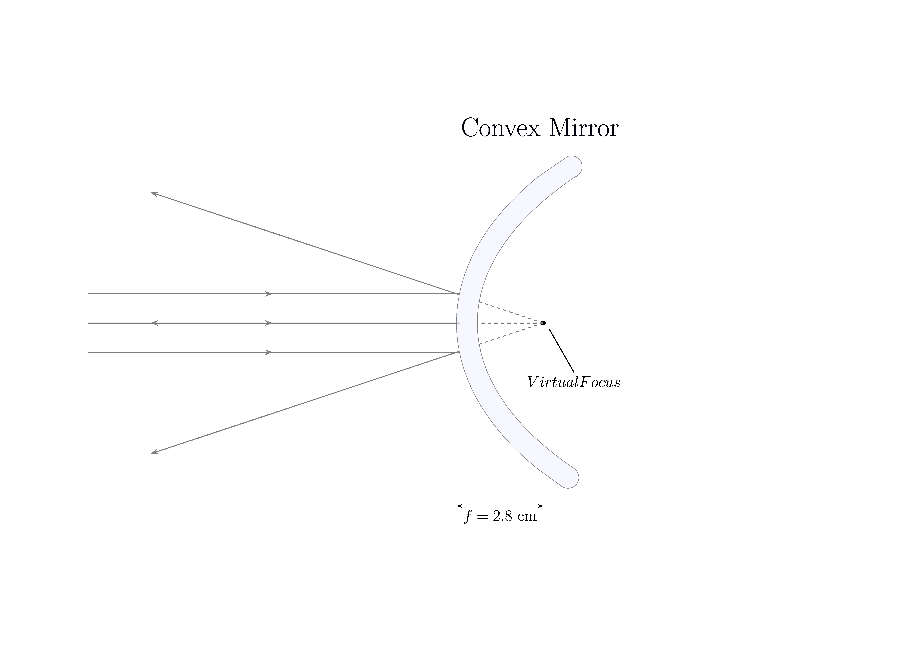
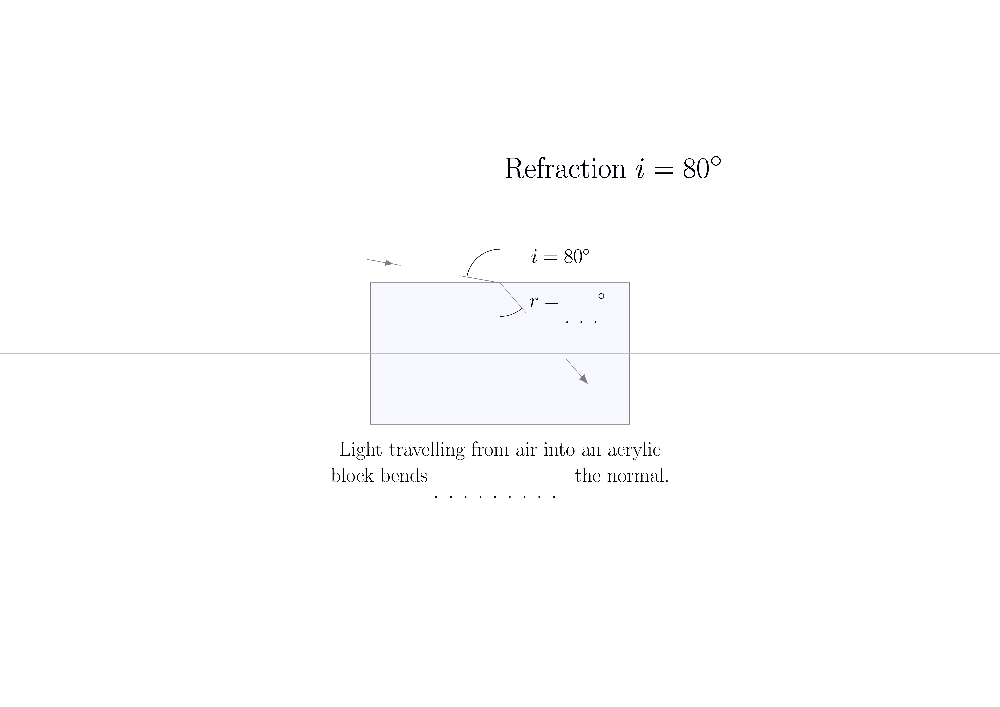
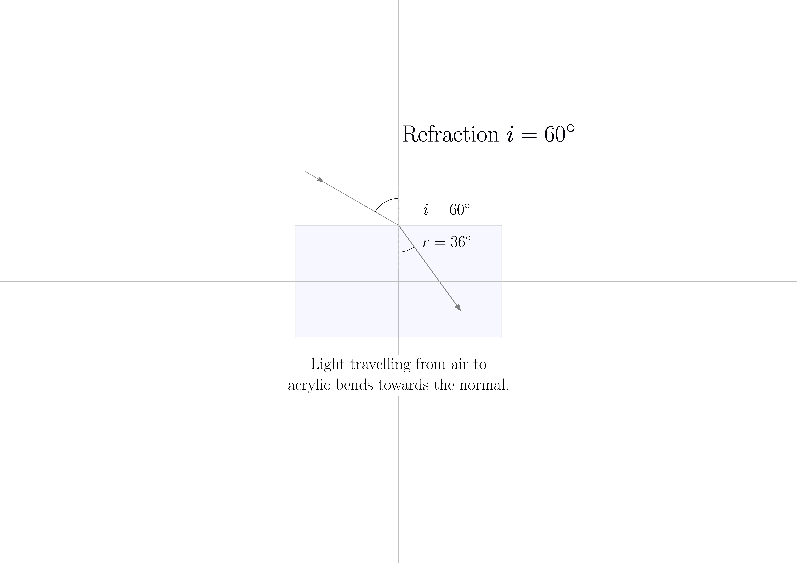
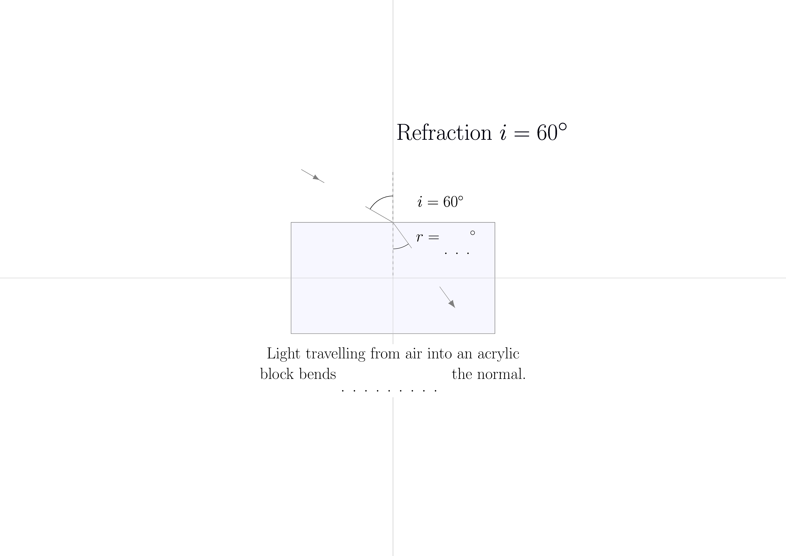
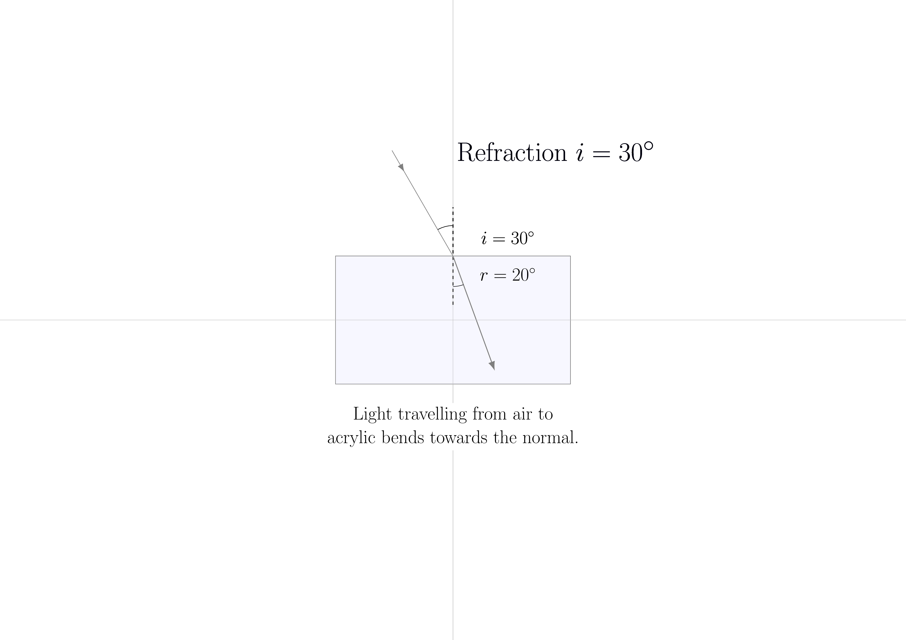
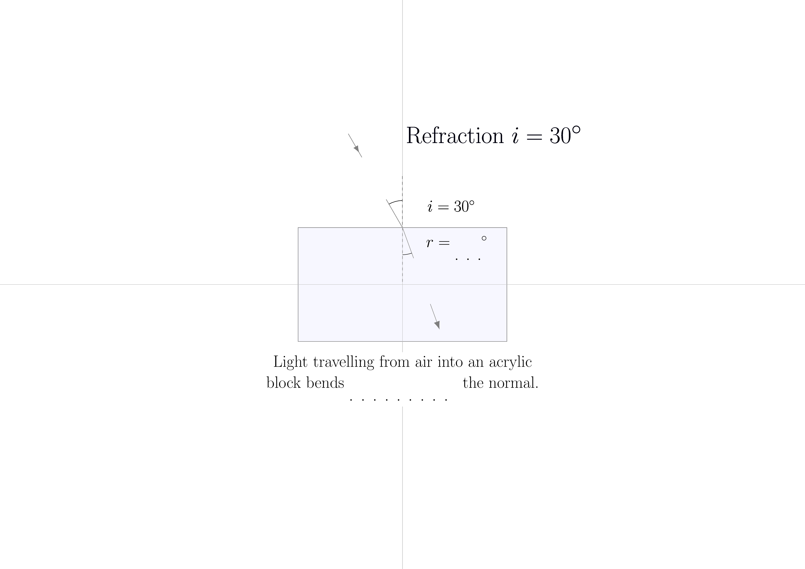

====================================================
RayTracing
====================================================

| For checking the curvature of mirrors, use a circle with center at twice the focal length.
| For lenses, use a circle at the focal length for a close approximation.
----

Lensmaker's Equation
====================

The focal length \( f \) of a thin lens in air is given by:

.. math::

   \frac{1}{f} = (n - 1) \left( \frac{1}{R_1} - \frac{1}{R_2} \right)

Where:

- \( f \) is the focal length of the lens
- \( n \) is the refractive index of the lens material
- \( R_1 \) is the radius of curvature of the first lens surface
- \( R_2 \) is the radius of curvature of the second lens surface

For a symmetric lens where \( R_1 = -R_2 = R \), the equation simplifies to:

.. math::

   \frac{1}{f} = \frac{2(n - 1)}{R}

Solving for \( R \):

.. math::

   R = 2(n - 1)f

| For acrylic, n = 1.49.
| So R = 0.98 f
| Hence, a circle of radius, f, at f, will be clos enough to manually observe curvature.

----

Optical axes
-------------------

| A simple cross shape on the landscape page is useful for ray diagrams.

.. figure:: files/optical_axes.png
   :width: 600
   :alt: optical_axes.png
   :figclass: align-center

| Downloads
| :download:`optical_axes_2pages.pdf<files/optical_axes_2pages.pdf>`
| :download:`optical_axes_2pages.tex<files/optical_axes_2pages.tex>`

----

Biconcave lens
-------------------

| Student version and full versions are shown below.

.. figure:: files/biconcave_lens.png
   :width: 600
   :alt: biconcave_lens.png
   :figclass: align-center

| Downloads
| :download:`biconcave_lens.pdf<files/biconcave_lens.pdf>`
| :download:`biconcave_lens.tex<files/biconcave_lens.tex>`

.. figure:: files/biconcave_lens_student.png
   :width: 600
   :alt: biconcave_lens_student.png
   :figclass: align-center

| Downloads
| :download:`biconcave_lens_student.pdf<files/biconcave_lens_student.pdf>`
| :download:`biconcave_lens_student.tex<files/biconcave_lens_student.tex>`

----

Biconvex lens
-------------------

| Student version and full versions are shown below.

.. figure:: files/biconvex_lens.png
   :width: 600
   :alt: biconvex_lens.png
   :figclass: align-center

| Downloads
| :download:`biconvex_lens.pdf<files/biconvex_lens.pdf>`
| :download:`biconvex_lens.tex<files/biconvex_lens.tex>`

.. figure:: files/biconvex_lens_student.png
   :width: 600
   :alt: biconvex_lens_student.png
   :figclass: align-center

| Downloads
| :download:`biconvex_lens_student.pdf<files/biconvex_lens_student.pdf>`
| :download:`biconvex_lens_student.tex<files/biconvex_lens_student.tex>`

----

Concave mirror
-------------------

| Student version and full versions are shown below.

.. figure:: files/concave_mirror.png
   :width: 600
   :alt: concave_mirror.png
   :figclass: align-center

| Downloads
| :download:`concave_mirror.pdf<files/concave_mirror.pdf>`
| :download:`concave_mirror.tex<files/concave_mirror.tex>`

| Downloads
| :download:`concave_mirror_student.pdf<files/concave_mirror_student.pdf>`
| :download:`concave_mirror_student.tex<files/concave_mirror_student.tex>`

----

Convex mirror
-------------------

| Student version and full versions are shown below.

| Downloads
| :download:`convex_mirror.pdf<files/convex_mirror.pdf>`
| :download:`convex_mirror.tex<files/convex_mirror.tex>`

.. figure:: files/convex_mirror_student.png
   :width: 600
   :alt: convex_mirror_student.png
   :figclass: align-center

| Downloads
| :download:`convex_mirror_student.pdf<files/convex_mirror_student.pdf>`
| :download:`convex_mirror_student.tex<files/convex_mirror_student.tex>`

----

Refraction in a block
-------------------------

| Student version and full versions are shown below.

| Downloads
| :download:`refraction_80.pdf<files/refraction_80.pdf>`
| :download:`refraction_80.tex<files/refraction_80.tex>`

| Downloads
| :download:`refraction_80_student.pdf<files/refraction_80_student.pdf>`
| :download:`refraction_80_student.tex<files/refraction_80_student.tex>`

----

| Downloads
| :download:`refraction_60.pdf<files/refraction_60.pdf>`
| :download:`refraction_60.tex<files/refraction_60.tex>`

| Downloads
| :download:`refraction_60_student.pdf<files/refraction_60_student.pdf>`
| :download:`refraction_60_student.tex<files/refraction_60_student.tex>`

----

| Downloads
| :download:`refraction_30.pdf<files/refraction_30.pdf>`
| :download:`refraction_30.tex<files/refraction_30.tex>`

| Downloads
| :download:`refraction_30_student.pdf<files/refraction_30_student.pdf>`
| :download:`refraction_30_student.tex<files/refraction_30_student.tex>`
