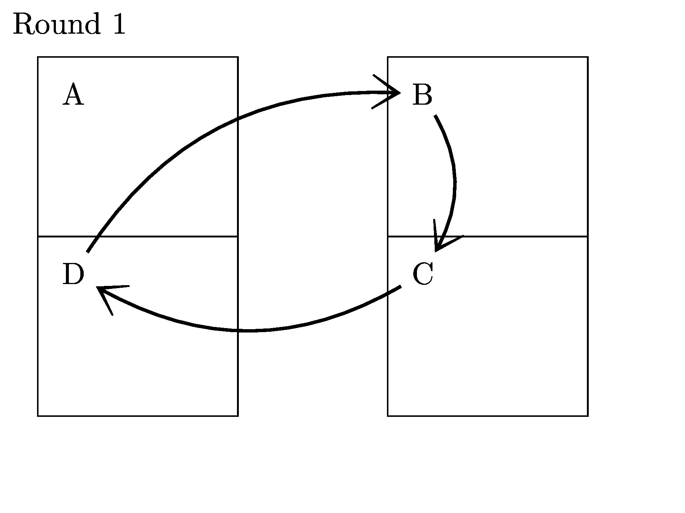
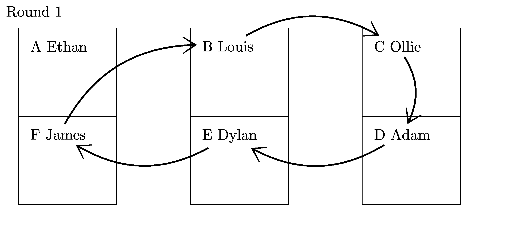

====================================================
Table tennis scoring
====================================================

Rapid Fire Round Robin
-----------------------

| Rapid fire fixtures are designed for matches of 5 to 10 min, completing multiple rounds in one session.

----

4 players
--------------

Place players A-D, B-C; move clockwise with player A staying in the same position.

.. literalinclude:: round_robin4.tex
   :linenos:

-----------

6 players
---------------

Place players A-F, B-E, C-D; move clockwise with player A staying in the same position.

.. literalinclude:: round_robin6.tex
   :linenos:

----

8 players
--------------------

Place players A-H, B-G, C-F, D-E; move clockwise with player A staying in the same position.

.. figure:: round_robin8_explained.png
   :width: 300
   :alt: round_robin8_explained.png
   :figclass: align-center

.. literalinclude:: round_robin8.tex
   :linenos:
