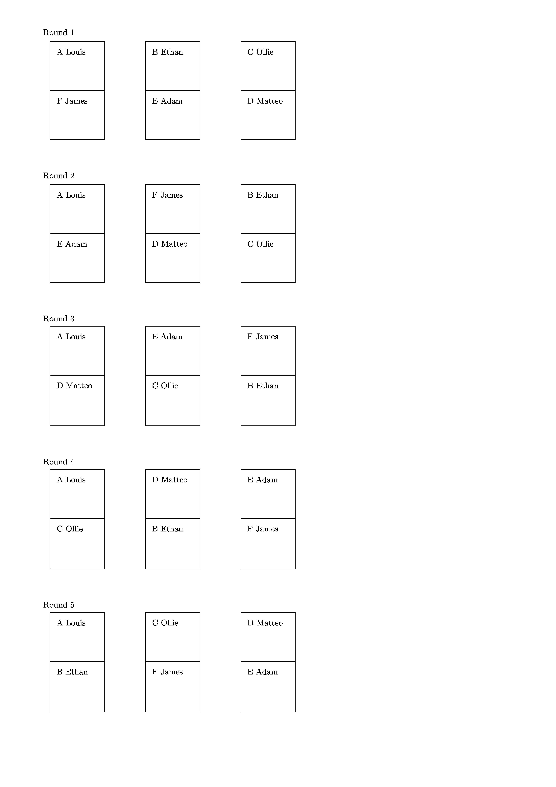

====================================================
Table tennis scoring
====================================================

Rapid Fire Round Robin
-----------------------

| Rapid fire fixtures are designed for matches of 5 to 10 min, completing multiple rounds in one session.

----

4 players
--------------

Place players A-D, B-C; move clockwise with player A staying in the same position.

| Files:
| :download:`round_robin4.tex<files/round_robin4.tex>`
| :download:`round_robin4.pdf<files/round_robin4.pdf>`

-----------

6 players
---------------

Place players A-F, B-E, C-D; move clockwise with player A staying in the same position.

| Files:
| :download:`round_robin6.tex<files/round_robin6.tex>`
| :download:`round_robin6.pdf<files/round_robin6.pdf>`

----

8 players
--------------------

Place players A-H, B-G, C-F, D-E; move clockwise with player A staying in the same position.

| Files:
| :download:`round_robin8.tex<files/round_robin8.tex>`
| :download:`round_robin8.pdf<files/round_robin8.pdf>`

